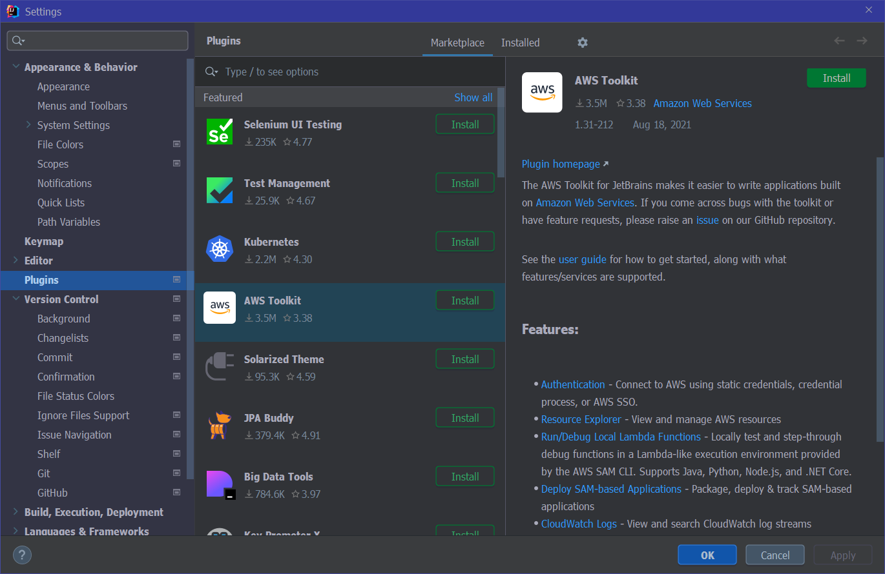
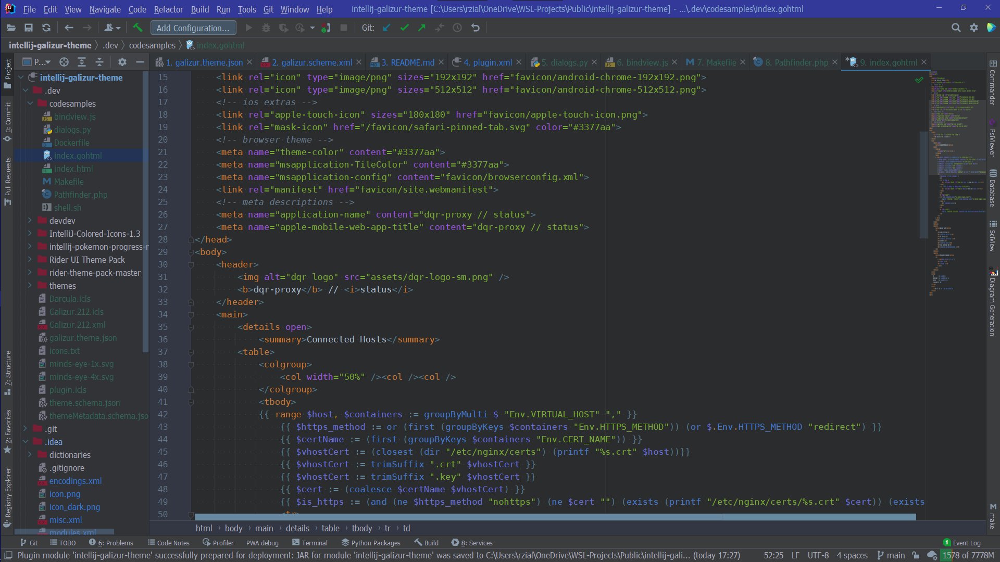
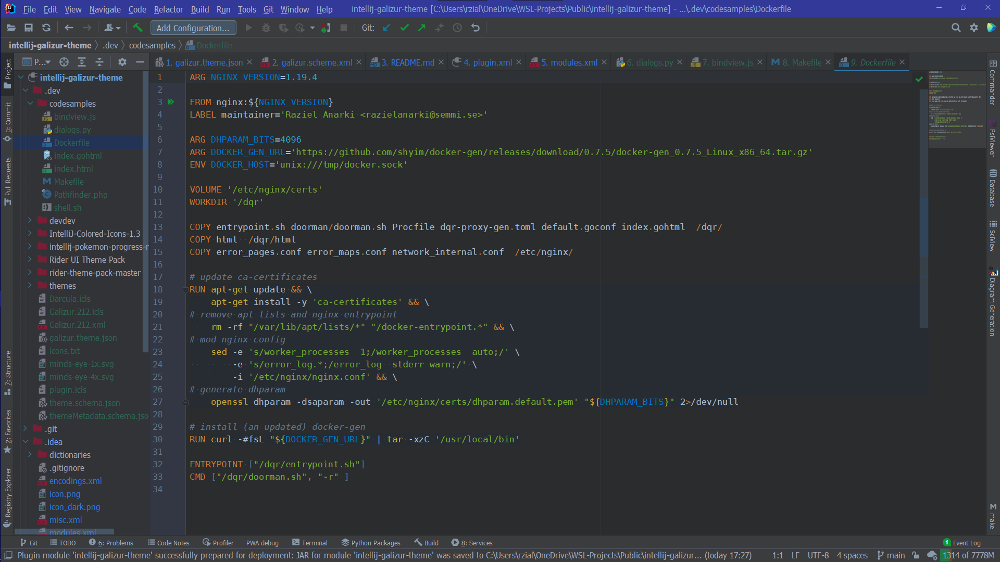
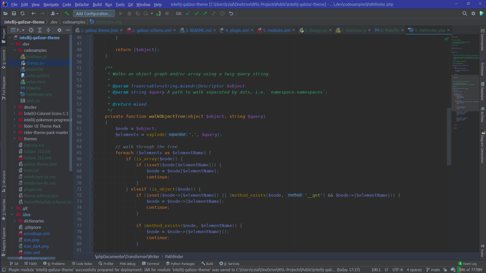
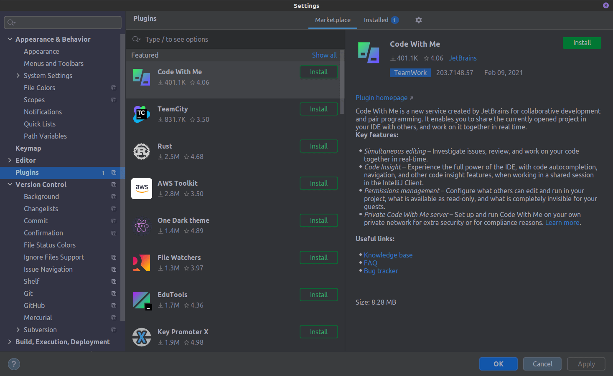
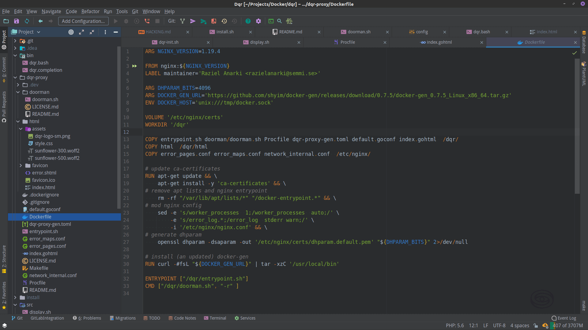
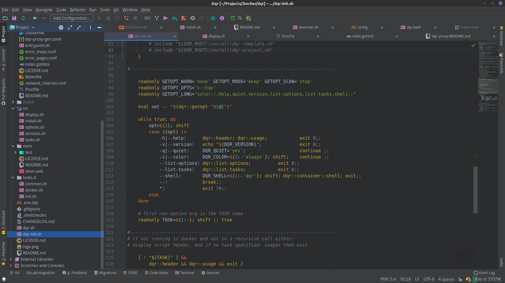

# intellij-galizur-theme 

> ### 🜀 &Tilde; 𝐆𝐀𝐋𝐈𝐙𝐔𝐑
> A spellbound, vibrant dark editor color scheme with matching UI theme for 𝗜𝗻𝘁𝗲𝗹𝗹𝗶𝗝 𝗜𝗗𝗘-s

&emsp;&raquo;&ensp;[Plugin Homepage][plugin]

## Description
A spellbound dark editor color scheme with matching UI theme for 𝗜𝗻𝘁𝗲𝗹𝗹𝗶𝗝 𝗜𝗗𝗘-s, contrived of vibrant magical colors (conjured using 🇭🇪🇽 triplets) over an inky, tenebrous backdrop, devised to aid 𝑐𝑙𝑎𝑖𝑟&sdot;𝑣𝑜𝑦𝑎𝑛𝑐𝑒 while crafting 𝚖𝚊𝚐𝚒𝚌 𝚌𝚘𝚍𝚎-🇸 on today's computer displays

The included terminal color scheme is available from&emsp;&raquo;&ensp;[mbadolato/iterm2-color-schemes][iterm]&emsp;for most terminals

## Version History

- ### version 1.2.1 (latest)
  - Update UI theme to support 𝗜𝗗𝗘𝗔 𝟮𝟬𝟮𝟭.𝟮
  - Fine- and re-tuning of editor color scheme
  - Updated plugin icon style
  - Removed IDE background images
  
- ### version 1.1.0
  - Additional UI theme customizations
  - Fine-tuning of editor color scheme, support for more languages

- ### version 1.0.0
  - Re-bundled editor color scheme alongside a matching UI theme
  - Additional syntax support
  - 𝗥𝗮𝗶𝗻𝗯𝗼𝘄 𝗕𝗿𝗮𝗰𝗸𝗲𝘁𝘀 support
  - Added ANSI terminal colors
  - Tweaked file status colors

- ### version 0.x.x
  - Basic editor color scheme

## Screenshots 

  
<kbd><strong>Version 1.2.1, Windows 10</strong> - <i>(click to expand)</i></kbd>

### Settings Window

### GO template in HTML

### Dockerfile

### PHP

  
<kbd><strong>Version 1.1.0, Linux</strong> - <i>(click to expand)</i></kbd>

  
### Settings Window

### GO template in HTML (with 𝗥𝗮𝗶𝗻𝗯𝗼𝘄 𝗕𝗿𝗮𝗰𝗸𝗲𝘁𝘀)

")

### Dockerfile

### Shell script

## Project License

Copyright &copy; 2021 by **Raziel Anarki**

This Project is licensed under the [MIT license][license].

[license]: LICENSE.md
[plugin]: https://plugins.jetbrains.com/plugin/16156-galizur-theme
[iterm]: https://github.com/mbadolato/iTerm2-Color-Schemes

> Ad astra per abditer nostra :
<kbd>𝟳𝟳𝟳</kbd>
<kbd>♄</kbd>
<kbd>⭙</kbd>
<kbd>A∴A∴</kbd>

