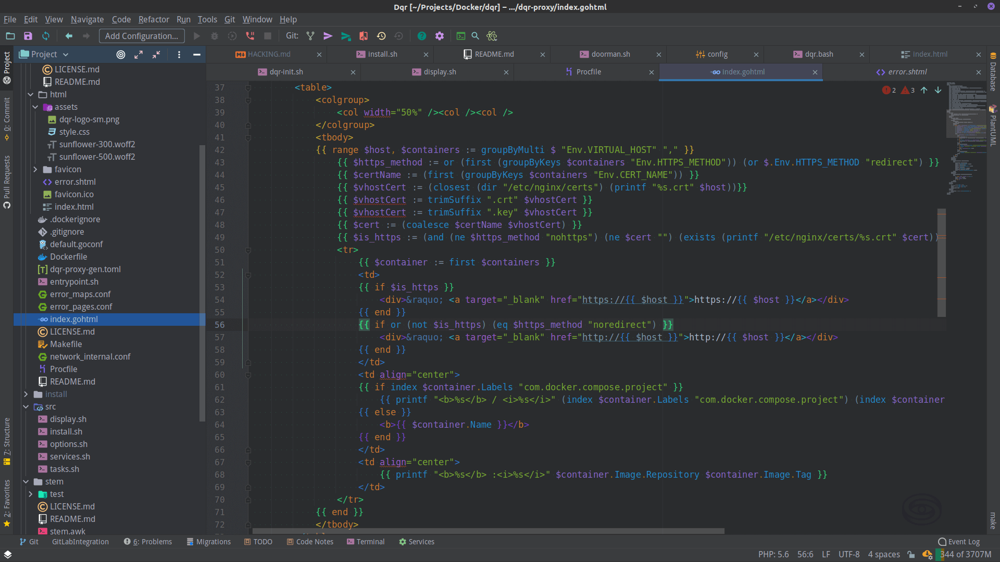

# Galizur<image width="137" align="right" src="resources/META-INF/pluginIcon.svg" />

A dark color scheme and matching UI theme  for **IntellIJ IDE**-s.

**[Plugin Homepage][plugin]**

## Description

A hand-crafted dark color scheme and matching UI theme, similar to the default "Darcula", with more magickally vibrant colors, _witch_ almost exclusively are short **_Hex Codes_**.

## Version History

### _1.0.0_

- Re-bundled alongside a matching UI theme.
- **Python**, **.properties**, **Makefile** support.
- **Rainbow Brackets** support.
- Adjusted ANSI console theme
- Tweaked file status colors.

## Screenshots

### Settings Window

### GO template in HTML

  
### Dockerfile

### Shell script

## License

Copyright &copy; 2021 Raziel Anarki

This project is licensed under the [MIT license][license].

[license]: LICENSE.md
[plugin]: https://plugins.jetbrains.com/plugin/16156-galizur-theme
